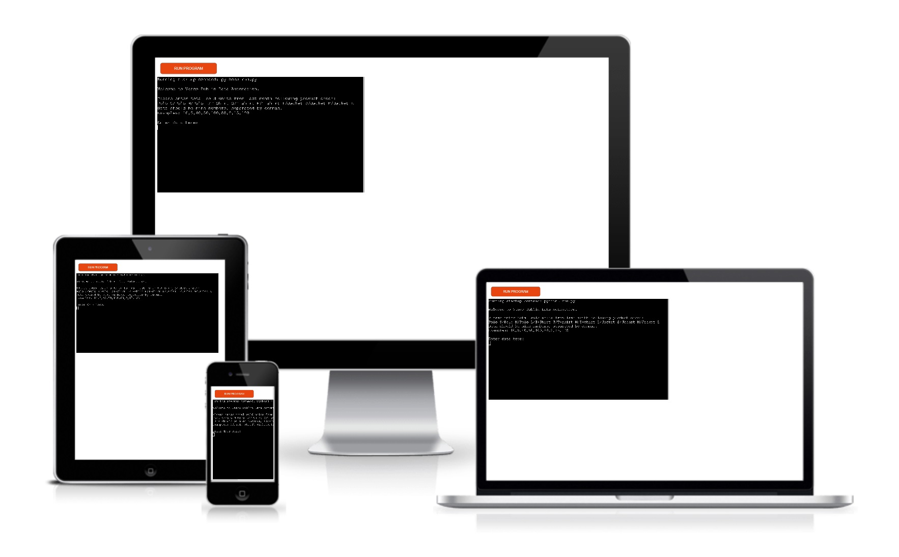
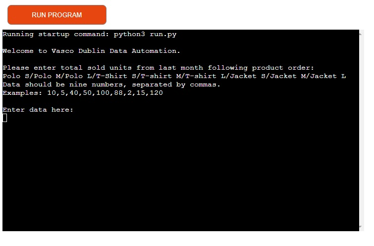
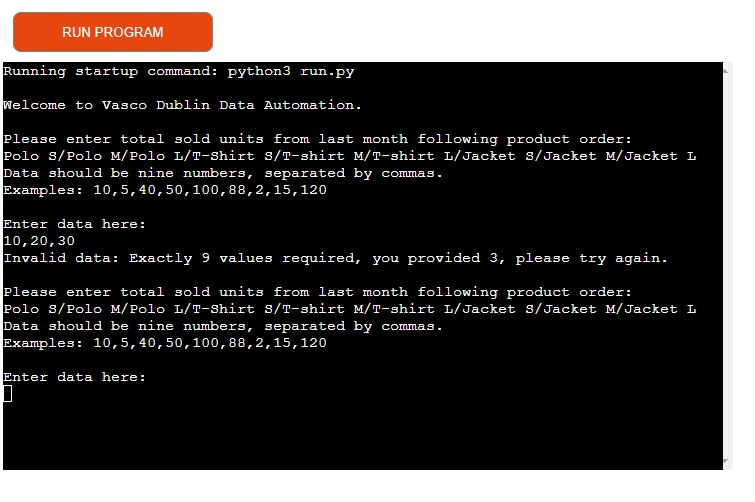
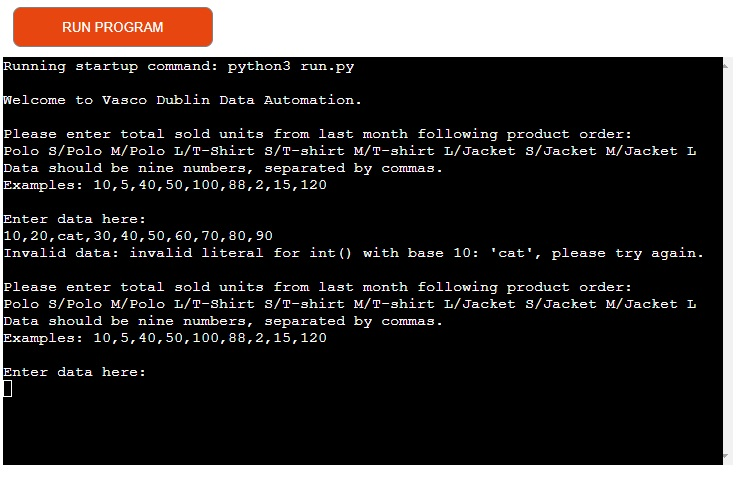
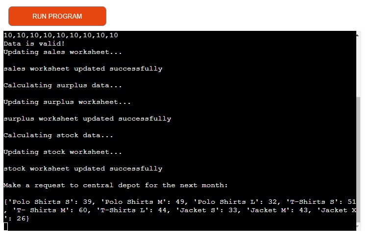

# Vasco Dublin Inventory APP

Vasco Dublin Inventory App is a Python terminal tool created to assist with stock control and estimate the necessary stock amount for the following month.

The main purpose of this inventory control is to reduce extra shipping costs extra orders from manufacturer, to reduce warehouse physical space as well waste of products being sold underprice due to clearence or to go under "out of stock".

[View the live project here](https://vasco-dublin.herokuapp.com/)

# How to operate
Easy terminal use trough Heroku APP, at start you will have a welcoming message, followed by instructions on which data to provide and how to input such. At the bottom a message will display where to input data. Any additional data will be displayed on screen.
# Features
## Existing Features

- __Data collection__
  - Welcome
  - Instructions
  - Enter Data

- __Input validation and error-check__
  - If data provided is invalid, message will return with error
  - System will inform issue, for example: Data with less or more then 9 digits
  - If data differs "Integers" invalid message will inform incorrect data

- __Update status__
  - Messages will inform each stage checked
  - Each step a calculation is made and update made to Google worksheet
  - From valid data all the way to final result "Stock data to be requested"

- __Stock data to be requested__
  - Result will provide amount for each item listed

## Future Features

- __Sign in credentials__ 
  - Have username and password verified for extra security and also to identify those operating the system
- __Advanced stock calculation__
  - Extract carryover value and if bigger or equal to same period last year times marketing goal, to keep stock with no need for supply, else supply amount equal to last year units sold times marketing target less carryover
 
# Data Model

# Testing

# Bugs
## Solved Bugs
  - aaa
## Remaining Bugs
  - No bugs remaining

# Validator Testing
  - PEP8 CI
    - No critical errors were returned from pep8ci.herokuapp.com
    - Several errors for blankspace and line too long fixed
    - 2 errors (E501) for lines 25 and 26 decided to be kept as under 94 characters and provides a better visual effect on terminal. 

# Deployment

# Credits

